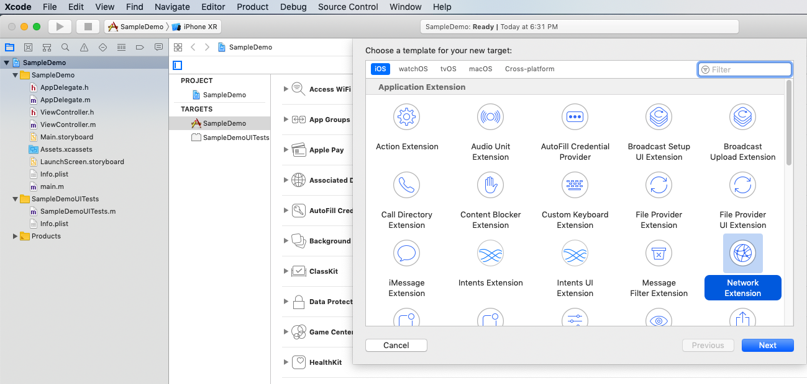
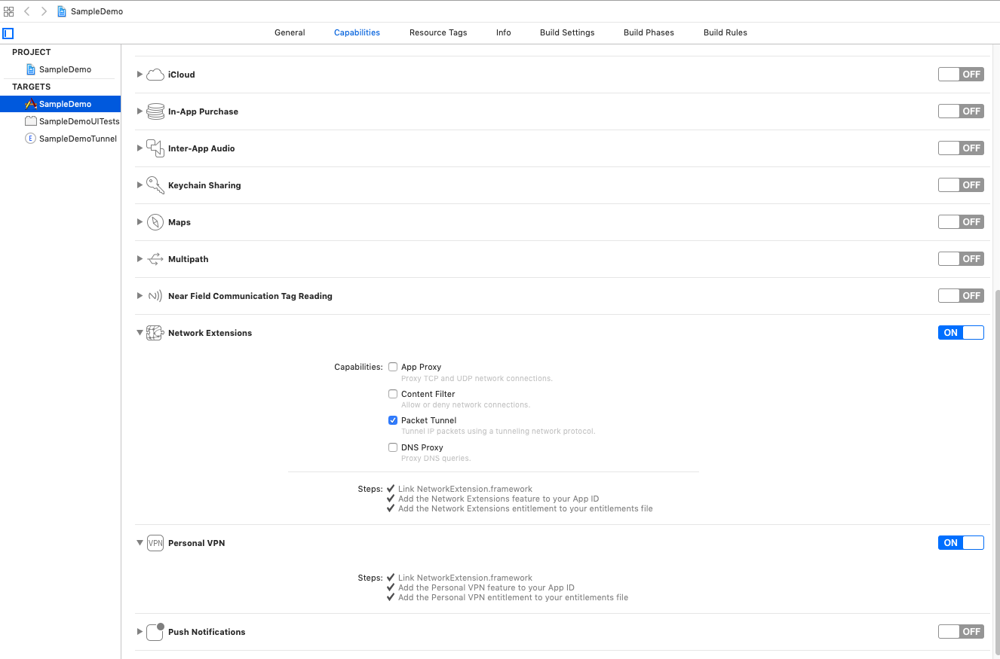
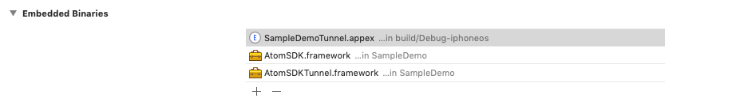
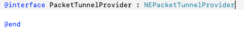
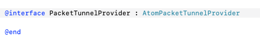
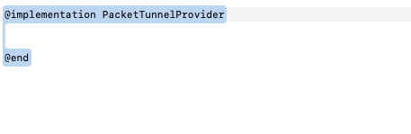
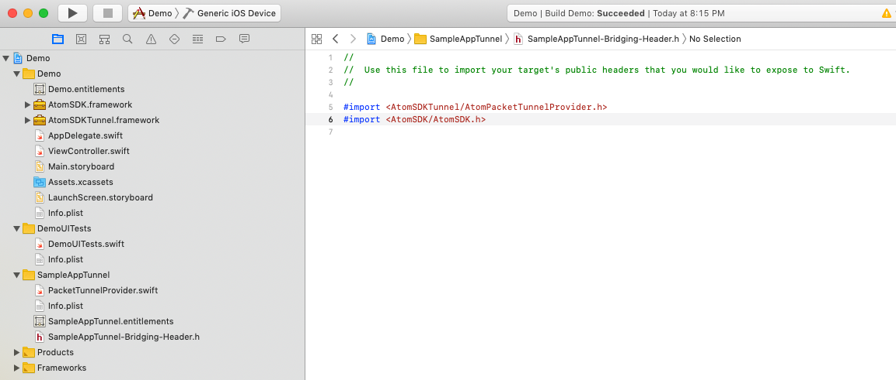

# ATOM VPN SDK demo for iOS Applications
This is a demo application for iOS Applications with basic usage of ATOM VPN SDK which will help the developers to create smooth applications over ATOM SDK quickly.

## SDK Features covered in this Demo
* Connection with Parameters	
* Connection with Pre-Shared Key (PSK)
* Connection with Dedicated IP
* Connection with Multiple Protocols (Auto-Retry Functionality)
* Connection with Real-time Optimized Servers (Countries based on latency from user in Real-time)
* Connection with Smart Dialing (Use getCountriesForSmartDialing() to get the Advanced VPN Dialing supported countries)

## Compatibility
* Compatible with Xcode 9 and iOS 9 and later
* Compatible with ATOM SDK Version 2.0 and onwards


## Supported Protocols
* IPSec
* IKEv2
* TCP
* UDP


## SDK Installation
Although ATOM SDK Framework is already provided with the demo application but you can install the latest version through [this link](https://secure.com/atom/downloads/sdk/ios/2.1.0/AtomSDK.zip). We have also introduced AtomSDKTunnel for Connecting VPN over TCP and UDP protocols. For detail information please follow [How to Integrate AtomSDKTunnel](#How-to-Integrate-AtomSDKTunnel-in-iOS-App)


# Getting Started with the Code
To add the SDK in Xcode:

1.    Open your Xcode project.

2.    Add your developer account to Xcode from Preferences -> Account if you didn't add before.

3. Select General tab from your app target and then set your developer account details.

4. From your app target select Capabilities tab and select the switch right of the Personal VPN. Then select the capabilties you are going to use.

5.    Drag and drop AtomSDK.framework into your project.

6.    Go to your project -> General tab from your app target, add the framework using ‘+’ to the Embedded Binaries section.

8.    After the setup is completed, you should be able to use all the classes from the SDK by including it with the #import <AtomSDK/AtomSDK.h> directive.
9.    ATOM SDK needs to be initialized with a “SecretKey” provided to you after you buy the subscription which is typically a hex-numeric literal.


Using App Secret Key
```
Use the following setup code in your AppDelegate's application:didFinishLaunchingWithOptions: method:

[AtomManager sharedInstanceWithSecretKey:@"<#Secret Key#>"];
```

OR

It can be initialized using an instance of AtomConfiguration. It should have a vpnInterfaceName which will be used to create the Network Interface for VPN connection. 

```
    AtomConfiguration *atomConfiguration= [[AtomConfiguration alloc] init];
    atomConfiguration.secretKey = @"SECRETKEY_GOES_HERE";
    atomConfiguration.vpnInterfaceName = @"Atom";
    atomConfiguration.tunnelProviderBundleIdentifier = “ENTER_YOUR _NETWORK_EXTENSION_BUNDLE_ID”;
    [AtomManager sharedInstanceWithAtomConfiguration:atomConfiguration];
```

PS: ATOM SDK is a singleton, and must be initialized before accessing its methods.

## Enable Local Inventory Support
ATOM SDK offers a feature to enable the local inventory support. This can help Application to fetch Countries and Protocols even when device network is not working.

* To enable it, Log In to the Atom Console
* Download the local data file in json format
* File name should be localdata.json. Please rename the file to localdata.json if you find any discrepancy in the file name.
* Paste the file in root of your application folder.

## Delegates to Register
ATOM SDK offers four delegates to register for the ease of the developer.
* atomManagerDidConnect:
* atomManagerDidDisconnect:
* atomManagerOnRedialing:
* atomManagerDialErrorReceived:

## StateDidChangedHandler to monitor a VPN connection status
ATOM SDK offers stateDidChangedHandler for the ease of the developer.
```
[AtomManager sharedInstance].stateDidChangedHandler = ^(AtomVPNState status) { };
```


## VPN Authentication
ATOM SDK provided two ways to authenticate your vpn user.
First one is to offer VPN Credentials directly to the SDK which you may create through the Admin Panel provided by ATOM.

```
[AtomManager sharedInstance].atomCredential = [[AtomCredential alloc] initWithUsername:@"<username>" password:@"<password>"];
```
Alternatively, if you don’t want to take hassle of creating users yourself, leave it on us and we will do the rest for you!

```
[AtomManager sharedInstance].UUID = @<"[[[UIDevice currentDevice] identifierForVendor] UUIDString]>";
```
You just need to provide a Unique User ID for your user e.g. any unique hash or even user’s email which you think remains consistent and unique for your user. ATOM SDK will generate VPN Account behind the scenes automatically and gets your user connected! Easy isn’t it?
# VPN Connection
You need to declare an object of “VPNProperties” Class to define your connection preferences. Details of all the available properties can be seen in the inline documentation of “AtomProperties” Class. For the least, you need to give Country and Protocol with which you want to connect.

```
AtomProperties* properties = [[AtomProperties alloc] initWithCountry:@"<country>" protocol:@"<protocol>"];
```
## Fetch Countries
Countries can be obtained through ATOM SDK as well.
```
[[AtomManager sharedInstance] getCountriesWithSuccess:^(NSArray<AtomCountry *> *success) {}
} errorBlock:^(NSError *error) {}];
```

## Fetch Countries For Smart Dialing
You can get the Countries those support Smart Dialing through ATOM SDK.
```
[[AtomManager sharedInstance] getCountriesForSmartDialing:^(NSArray<AtomCountry *> *success) {}
} errorBlock:^(NSError *error) {}];
```

## Fetch Protocols
Protocols can be obtained through ATOM SDK as well.

```
[[AtomManager sharedInstance] getProtocolsWithSuccess:^(NSArray<AtomProtocol *> *success) {}
errorBlock:^(NSError *error) {}];
```
### How to Connect

As soon as you call Connect method, the events you were listening to will get the updates about the states being changed and VPNDialedError  (if any occurs) as well.


### Connection with Parameters
It is the simplest way of connection which is well explained in the steps above. You just need to provide the country and the protocol objects and call the Connect method.
```
AtomProperties* properties = [[AtomProperties alloc] initWithCountry:@"<#country#>" protocol:@"<#protocol#>"];

[[AtomManager sharedInstance] connectWithProperties:properties completion:^(NSString *success) {}
errorBlock:^(NSError *error) {}];
```
### Connection with Pre-Shared Key (PSK)
In this way of connection, it is pre-assumed that you have your own backend server which communicates with ATOM Backend APIs directly and creates a Pre-Shared Key (usually called as PSK) which you can then provide to the SDK for dialing. While providing PSK, no VPN Property other than PSK is required to make the connection. ATOM SDK will handle the rest.
```
AtomProperties *properties = [[AtomProperties alloc] initWithPreSharedKey:@"<#PSK#>"];

[[AtomManager sharedInstance] connectWithProperties:properties completion:^(NSString *success) {}
errorBlock:^(NSError *error) {}];
```
### Connection with Dedicated IP
You can also make your user comfortable with this type of connection by just providing them with a Dedicated IP/Host and they will always connect to a dedicated server! For this purpose, ATOM SDK provides you with the following constructor.
```
AtomProperties *properties = [[AtomProperties alloc] initWithDedicatedHostName:@"<#DedicatedIP/Host#>" protocol:@"<#protocol#>"];

[[AtomManager sharedInstance] connectWithProperties:properties completion:^(NSString *success) {}
errorBlock:^(NSError *error) {}];
```

### Connection with Real-time Optimized Servers
This one is same as the first one i.e. “Connection with Parameters” with a slight addition of using Real-time optimized servers best from your user’s location. You just need to set this property to TRUE and rest will be handled by the ATOM SDK.
```
AtomProperties* properties = [[AtomProperties alloc] initWithCountry:@"<#country#>" protocol:@"<#protocol#>"];
[properties setUseOptimization:YES];

[[AtomManager sharedInstance] connectWithPropertiesconnectWithProperties:properties completion:^(NSString *success) {}
errorBlock:^(NSError *error) {}];
```

If you want to show your user the best location for him on your GUI then ATOM SDK have it ready for you as well! ATOM SDK has a method exposed namely “getOptimizedCountries” which adds a property “RoundTripTime” in the country object which has the real-time latency of all countries from your user’s location (only if ping is enabled on your user’s system and ISP doesn’t blocks any of our datacenters). You can use this property to find the best speed countries from your user’s location.

### Connection with Smart Dialing
“Connection with Parameters” with a slight addition of using smart dialing to connect. You just need to call "withSmartDialing" and rest will handled by the ATOM SDK.
```
AtomProperties* properties = [[AtomProperties alloc] initWithCountry:@"<#country#>" protocol:@"<#protocol#>"];
[properties setUseSmartDialing:YES];
[[AtomManager sharedInstance] connectWithProperties:properties completion:^(NSString *success) {}
errorBlock:^(NSError *error) {}];
```

For more information, please see the inline documentation of AtomProperties Class.

### Connection with Multiple Protocols (Auto-Retry Functionality)
You can provide three protocols at max so ATOM SDK can attempt automatically on your behalf to get your user connected with the Secondary or Tertiary protocol if your base Protocol fails to connect. 

```
properties.secondaryProtocol = @"<protocol2>";
properties.tertiaryProtocol = @"<protocol3>";
```

# Cancel VPN Connection
You can cancel connection between dialing process by calling the cancelVPN method.
```
[[AtomManager sharedInstance] cancelVPN];
```
# Disconnect VPN Connection
To disconnect, simply call the disconnectVPN method of AtomManager.
```
[[AtomManager sharedInstance] disconnectVPN];
```

# How to Integrate AtomSDKTunnel in iOS App
1.  Open your Xcode project. 
2. Add your developer account to Xcode from Preferences -> Account if you didn't add before. 
3. Select General tab from your app target and then set your developer account details. 
4. Now add new target “Network extension” in your Xcode project. 




5. From your app target and Extension target select capabilities tab and enable both Personal VPN and the Network Extension. Then select the capabilities you are going to use. 




6. Drag and drop AtomSDK.framework and AtomSDKTunnel.framework into your project. 
7. Select AtomSDKTunnel.framework for both App target and Extension target in Target Member ship section in right side of Xcode.

8. Go to your project -> General tab from your app target, add both frameworks using ‘+’ to the Embedded Binaries section. 




9. After the setup is completed, you should be able to use all the classes from the SDK by including it with the #import <AtomSDK/AtomSDK.h> and <AtomSDKTunnnel/AtomPacketTunnelProvider.h> directives in your App and extension target.


10. Now in extension target NEPacketTunnelProvider.h class, inherit class with AtomPacketTunnelProvider instead of NEPacketTunnelProvider.
 


**with**



 
11. Also in NEPacketTunnelProvider.m file, remove all methods.



AtomSDK can be initialized using an instance of AtomConfiguration. It should have a vpnInterfaceName which will be used to create the Network Interface for VPN connection. Also, there is tunnelProviderBundleIndentifier in which you have to enter the bundle ID of Network Extension of your project.

AtomConfiguration *atomConfiguration = [AtomConfiguration alloc]init];
atomConfiguration.secretKey = @” SECRETKEY_GOES_HERE”;
atomConfiguration.vpnInterfaceName = @”Atom”;
atomConfiguration.tunnelProviderBundleIdentifier = “ENTER_YOUR _NETWORK_EXTENSION_BUNDLE_ID”;
[atomConfiguration sharedInstanceWithAtomConfiguration: atomConfiguration];

Note:

If you are using these AtomSDK.framework and AtomSDKTunnel.framework in swift App, then in step 9 all mentioned directives should be included in the Objective - C bridging header file.




# Distributing to App Store
While distributing application to app store developer should add Run Script in Build phase before the app can be submitted to the iTunes App Store. This type of “Fat Binary” framework will not pass the App Store validation process, so we will need to strip the simulator architecture version from the framework using the following shell script. When you build and archive the app for release, the fat binaries will be stripped and the app can be submitted to the iTunes App Store.

Select the Project in xcode, Choose Target → Project Name → Select Build Phases → Press “+” → New Run Script Phase → Name the Script as “Remove Unused Architectures Script”.

```
FRAMEWORK="AtomSDK"
echo "Trimming $FRAMEWORK..."
FRAMEWORK_EXECUTABLE_PATH="${BUILT_PRODUCTS_DIR}/${FRAMEWORKS_FOLDER_PATH}/$FRAMEWORK.framework/$FRAMEWORK"
EXTRACTED_ARCHS=()
for ARCH in $ARCHS
do
    echo "Extracting $ARCH..."
    lipo -extract "$ARCH" "$FRAMEWORK_EXECUTABLE_PATH" -o "$FRAMEWORK_EXECUTABLE_PATH-$ARCH" EXTRACTED_ARCHS+=("$FRAMEWORK_EXECUTABLE_PATH-$ARCH")
done
echo "Merging binaries..."
lipo -o "$FRAMEWORK_EXECUTABLE_PATH-merged" -create "${EXTRACTED_ARCHS[@]}"
rm "${EXTRACTED_ARCHS[@]}"
rm "$FRAMEWORK_EXECUTABLE_PATH"
mv "$FRAMEWORK_EXECUTABLE_PATH-merged" "$FRAMEWORK_EXECUTABLE_PATH"
echo "Done."
```
Thats all !!
This run script removes the unused simulator architectures only while pushing the application to the App Store.

## Note:
The current version of the VPN Atom SDK uses the following library under the hood:

* NEVPNManager
* NEVPNTunnelProvider
